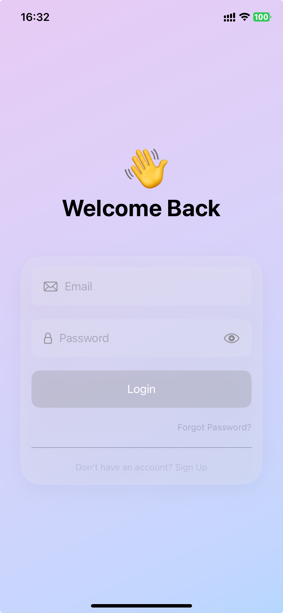
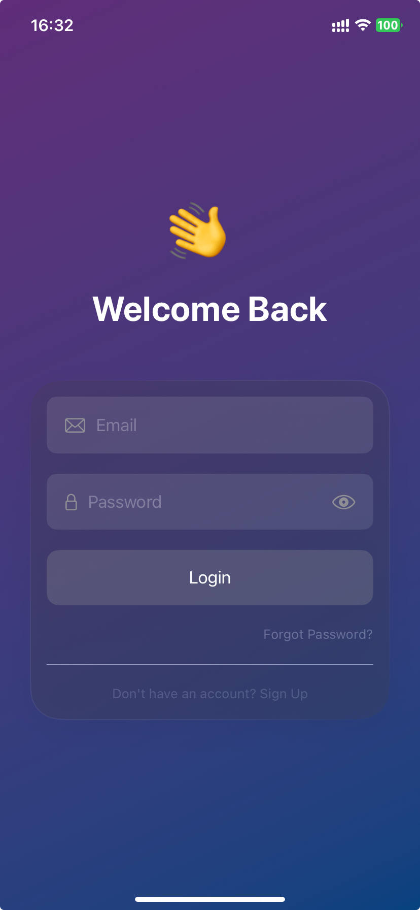

# Liquid Glass Project

This project demonstrates a **custom Liquid Glass (Glassmorphism)** effect in Swift, designed to be compatible with older iOS versions that don’t support native blur materials. It also includes a sample login screen UI to showcase the effect in both light and dark modes.

## Screenshots

### Light Mode



### Dark Mode



## Demo Video


## Installation

```bash
git clone https://github.com/FarhanMehran/liquidglassexample.git
```

## Features

* Custom Liquid Glass background effect
* SwiftUI-based UI components
* Support for both Light and Dark modes
* Compatible with older iOS versions

## License

This project is open-source and free to use under the MIT License.

